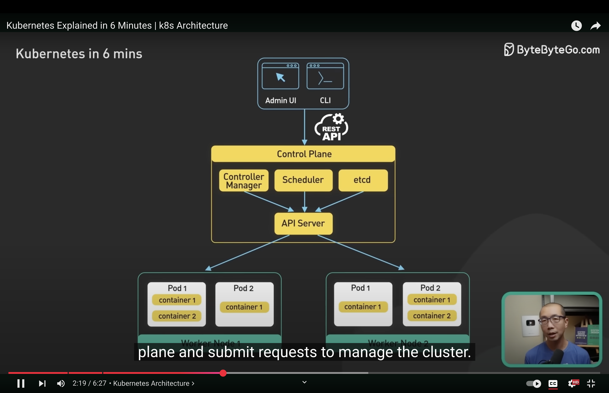
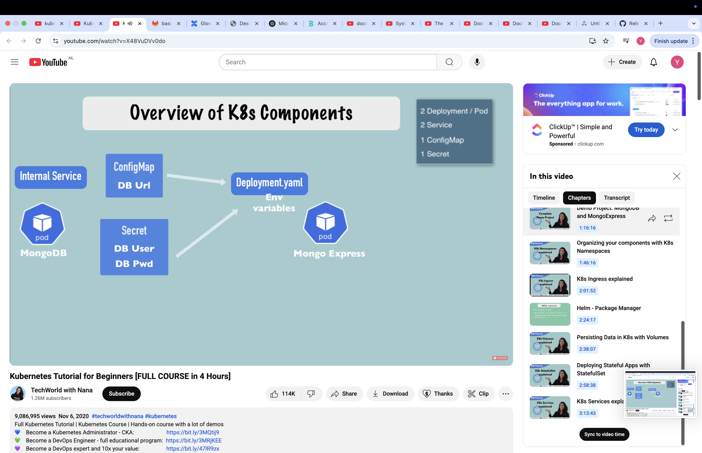
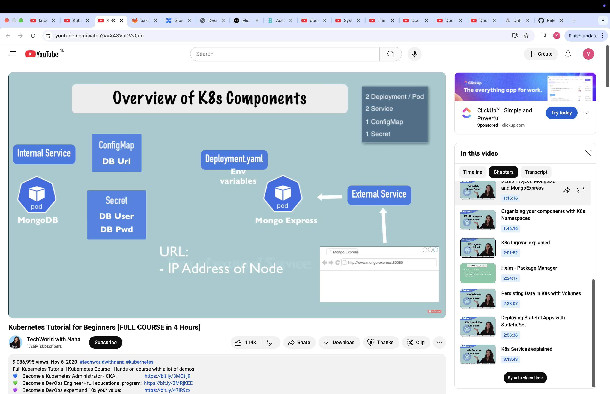
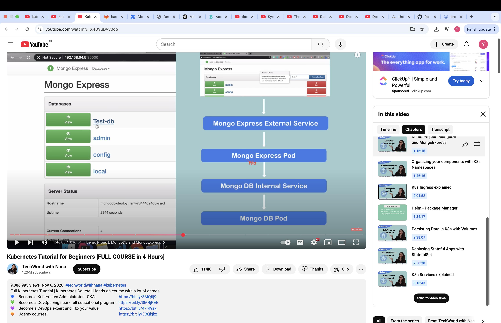
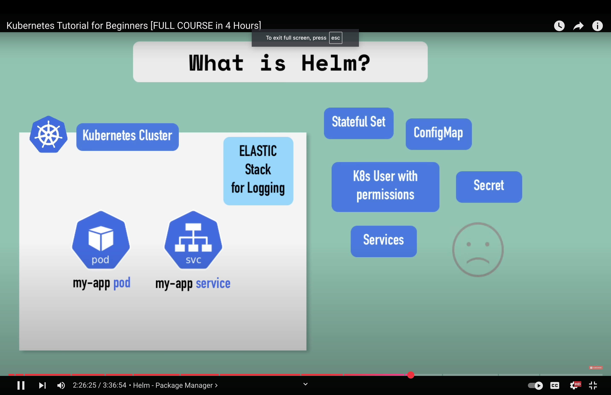

# 🚢 Kubernetes

- Kubernetes is an open-source container orchestration platform (manages containers).
- It automates deployment, scaling, and management of containerized applications.
- Helps manage applications composed of multiple containers across different environments.
- Kubernetes does **not** manage application data persistence — backups and replication are our responsibility.
- A system deployed on Kubernetes is called a **cluster**.

---

## 🌐 Cluster

A Kubernetes cluster is a set of machines (**nodes**) used to run containerized applications.

### Cluster has two main parts:

#### 🧠 Control Plane
Responsible for managing the state of the cluster.  
In production, it usually runs on multiple nodes across different zones.

Components:
- API Server  
- etcd  
- Scheduler  
- Controller Manager  

Clients communicate with the Control Plane using REST APIs.

#### ⚙️ Worker Nodes
Run containerized application workloads inside **Pods**.

Components:
- **Kubelet** – communicates with Control Plane and container runtime.
- **Container Runtime** – pulls images and runs containers.
- **Kube-proxy** – routes traffic and provides load balancing.

---

### 🔁 Internal Working of Kubernetes Cluster

| Kubernetes Cluster Flow |
|-------------------------|
| 
  
 |

---

## 💡 Why Kubernetes?

In **microservices architecture**, each service is containerized for easier scaling and management.  
Kubernetes manages and orchestrates these containers together.

---

## ⚠️ Problems Kubernetes Solves

1. High availability (no downtime)
2. Scalability and performance
3. Disaster recovery
4. Self-healing and automatic rollbacks
5. Horizontal scaling
6. Portability (on-prem, cloud, or hybrid)

### Managed Kubernetes Services
- **EKS** (AWS)
- **GKE** (Google)
- **AKS** (Azure)

---

## ⚙️ Kubernetes Components

| Component Diagram | Component Diagram |
|------------------|------------------|
|  |  |

---

## 🧱 Node & Pod

- Node = physical or virtual machine.
- Pods run inside nodes.
- Pod is an abstraction over containers.
- Usually one application per pod.
- Each pod has its own IP address.
- Example: App and database run in separate pods.

---

## 🌍 Service & Ingress

- Pods communicate using **Services**.
- Services have static IP and DNS.
- Services provide load balancing.
- Pod and Service lifecycles are independent.

### Types of Services:
- Internal Service
- External Service

**Ingress** routes traffic into the cluster and forwards it to services.

---

## 🔐 ConfigMap & Secret (External Configuration)

- **ConfigMap** stores non-sensitive configuration (e.g., DB URL).
- **Secret** stores sensitive data (base64 encoded).
- ConfigMaps and Secrets must be connected to Pods.

---

## 💾 Volumes (Data Persistence)

Used when pods need persistent data (e.g., databases).

Types:
- Local volumes  
- Remote volumes (cloud storage)

Data persists even if the pod restarts.

---

## 📦 Deployment & StatefulSet

### Deployment
- Blueprint for pods
- Manages replicas and scaling

### StatefulSet
- Used for databases and stateful applications

---

## 🧪 kubectl Commands

| Command | Description |
|--------|-------------|
| `kubectl -h` | Show help |
| `kubectl get pods` | List pods |
| `kubectl get deployments` | List deployments |
| `kubectl get nodes` | List nodes |
| `kubectl get services` | List services |
| `kubectl logs pod_name` | View pod logs |
| `kubectl describe pod pod_name` | Detailed pod info |
| `kubectl exec -it pod_name -- /bin/bash` | Access pod shell |
| `kubectl config get-contexts` | List contexts |
| `kubectl config current-context` | Show active context |
| `kubectl apply -f config.yaml` | Apply configuration |
| `kubectl describe service service_name` | Debug service |
| `kubectl get pods -o wide` | Detailed pod list |
| `kubectl get all` | Show all resources |
| `kubectl get configmap -o yaml` | View ConfigMap |

---

## 📁 Namespace

A virtual cluster inside a Kubernetes cluster.

---

## 🔄 Request Flow

    Browser → Ingress → Service → Pod

  

---

## 🏗️ Architecture

1. Cluster consists of Control Plane and Worker nodes
2. Worker nodes do the actual work
3. Worker node contains:
   - Container runtime
   - Kubelet
4. Kubelet starts Pods
5. Kube-proxy forwards requests from Services to Pods

---

## ⎈ Helm

| Helm |
|------|
| 
 
|

Helm simplifies Kubernetes application deployment.

Without Helm:
- Each user must configure all YAML files manually.

With Helm:
- One person creates and packages YAML files into a **Helm chart**.
- Others can reuse the chart easily.

### Features:
1. Package manager for Kubernetes.
2. Packages YAML files into charts.
3. Charts can be stored in public or private repositories.
4. You can:
   - Create your own charts.
   - Download and use existing charts.

### Use Case:
For microservices:
- Deployment and service YAMLs differ only in app name and version.
- Helm allows creating a common template.
- Dynamic values are replaced using external configuration files.
- Easy deployment across multiple environments (dev, test, prod).

---

## ☁️ GCP / GKE

Commands:

    kubectl config current-context
    helm -n backoffice ls

---

## 🧰 Tech Stack (onboarding-infra)

### Kubernetes (K8s)

Used for container orchestration and managing microservices deployment.

### Helm

Packages and deploys Kubernetes applications.

Used to deploy services like:

    onboarding-cs
    broker-accounts-command

### Terraform

Provisions Kubernetes resources and manages infrastructure components.

Example:

    terraform/kubernetes/modules/broker-accounts-command/main.tf

### Google Cloud Platform (GCP)

- GKE for Kubernetes clusters
- Cloud SQL
- IAM and networking via gcloud

### SOPS

Encrypts and manages sensitive Kubernetes secrets.

### Bash Scripts

Scripts such as:

    create.sh
    create-test.sh

Used for:
- Cluster creation
- Resource provisioning
- Service deployment

