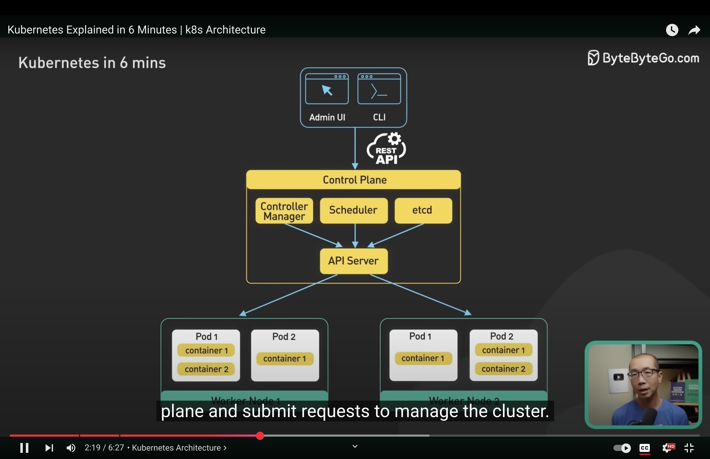
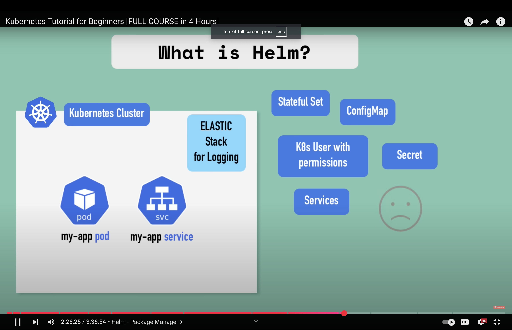

# Kubernetes

- Kubernetes is open source container orchestration platform (manages containers)
- It automates the deployment,scaling & management of containized applications.
- Helps you managed containerized applications (manage applications that are made up of many containers) in different environments
- K8s doesn't manage data persistence (we are responsible for backing up the data/replicating/managing it) -- here we talking about the application data

- A system deployed on k8s is known as cluster.

1. A Kubernetes cluster is a set of machines, called nodes, that are used to run containized applications.
2. 2 main pieces in k8s cluster :
	1. Control Plane : Responsible for managing the state of the cluster. In prod env, the control plane usually runs on multiple nodes that span accross several data center zones.
	1. Set of worker nodes : Run the containized applications workloads. Containized applications run in a POD. Pod hosts one or more containers & provide shared storage (db) and networking for those containers.
3. Pods are created and managed by k8s control plane.
4. Control plane : consists of 4 components : API server, etcd, scheduler and controller manager.
5. Clients submit the request to control plane to manage cluster using rest APIs.
6. Worker nodes :
	1. Kubelet
	1. Container runtime : runs containers on the worker nodes. It is responsible for pulling the container image from a registry & starting/stopping/managing the container's resources.
	1. Kube-proxy : provides load balancing and routes traffic to correct pods.

|   Kubernetes Internal working  |
| --- |
|  |
|  |

*What generally happens*
- In a microservice architecture, we containerize each application for easy scaling or management of those services. And we need a tool/framework to manage those containers together that is where Kubernetes comes in place.

*What problems Kubernetes solve*

1. High Availability or no downtime (application has no downtime)
1. Scalability or high performance
1. Disaster Recovery
1. self healing, automatic rollbacks, horizontal scaling.
1. Makes it easy to scale our application up and down as needed.
1. It is portable. It runs on on-premise, public cloud or in a hybrid env. Provides a uniform way to package,deploy and manage applications.

- Managed k9s services are provided by cloud providers : EKS, GKE, AKS

*Kubernetes Components*

|  Kubernetes Components   |
| --- |
|  |
|  |
|  |

1. Node & Pod
: 
	- Node is physcial/virtual server. Pod's are inside this server.
	-  Pod is an abstraction over container.
	- usually 1 application per Pod.
	- Each Pod gets its own IP address
	-  Ex : an application which has a db connection. In this case 2 have 2 pods.
	- Pod : abstraction of containers

1. Service & Ingress
: 
	- Pod's communicate with each other using a service.
	- Service has permanenet/static IP address with a DNS name.
	- Service can also act as a load balancer.
	- can be attached to each Pod.
	- lifecycle of Pod and services are not connected.
	- External service and Internal service
	- **Ingress routes traffic into the cluster.**
	- Ingress does the forwarding to services.
	- Service : communication between different pods and between different nodes.

1. ConfigMap & Secret
: **External configuration**
	- ConfigMap is used for setting external configuration of your application. For ex : db url, etc. So that in future if the URL changes, we just change the config map and the main service doesn't get affected (we don't need to redeploy it).
	- Secret is just like config map but it used to store secret data (base64 encoded).
	- You need to connect config map/ secret to your Pod.

1. Volumes
: **Data Persistence**
	- we have a pod which has a database and we want it to be persisted even when it restarts, here volumes comes to rescue.
	- we can attach volumes to the database pod and store them either locally or remotely (outside the k8s cluster) (cloud storage, etc)

1. StatefulSet & Deployment
: 
	- Deployments : blueprint for my-app pods / replicas
	- Deployment takes care of replicas and scaling.
	- Deployments are abstraction of pods.
	- Db's can be replicated using deployments.
	- Stateful is for databases or stateful apps.

#### Architecture
: 
	1. Master and slave nodes.
	1. Worker nodes do the actual work.
	1. Woker machine in k8s cluster : container runtime, kubelet(interacts with both container runtime and node).
	1. Kubelet starts the pod with a conatiner inside.
	1. Kube proxy forwards the requests (forwarding requests from services to pods)

## KubeCtl

- We work with deployments and not the actual pods.
1. Kubectl -h (help)
1. kubectl get pod/deployment/nodes/services
1. kubectl logs pod_name (debug)
1. kubectl describe pod pod_name (get info about pod - debug)
1. kubectl exec -it pod_name -- bin/bash
1. kubectl config get-contexts
1. kubectl config current-context
1. kubectl apply -f config.yaml (for chaning and applying configuration to deployment)
1. kubctl describe service service_name (validate the right pods) -- run for a service
1. kubectl get pod -o wide
1. kubectl get all
1. kubectl get configmap -o yaml
1.

- We create deployment with some image using kubctl create deployment ... (command)

## Namespace
Virtual cluster inside a cluster.

FLOW : 

BROWSER -> INGRESS -> SERVICE (INTERNAL) -> POD 

|  Kubernetes  |
| --- |
|  |
|  |

## K9s

## Docker

## Helm

|  |
|  |
| Let's say we have deployed our app in k8 cluster and now we want to do logging. Without helm, each person who wants to do logging will have to configure all the yaml files relating to it. Helm provides a easy way to achieve this where just one person can do the work of configuring yaml files and package them and make it available somewhere so that others can just use it. That bundle of yaml files is called as "helm chart"|

1. Package manager for k8s.
1. Way to package yaml files and distribute them in public and private repos.
1. Using helm, we can create our own helm charts & push them to helm repo. 
1. We can also download the charts created by others and use them.
1. Other use case of helm is :
	Imagine we have an app that is made up of multiple microservices & we are deploying all of them in our k8 cluster. Deployment and service of each of those microservice just different by app name and version or docker image number and version tag. Without helm, we would have to write separate config files for all of them. To avoid this we can use helm to define a common blueprint for all the microservices & the values that are going to change replaced by placeholder. This would be called as a template file where at some places instead of values we would have syntax, which would mean we are taking value from external configuration.
	And that external config comes from an additional yaml file. The easy way for this is to replace these values in our build pipelines.
1. We can also use helm to reploy accrodd diff env's by making our own helm chart and deploying them across different env's.

## GCP/GKE

1. kubectl config current-context

1. helm -n backoffice ls 

## Tech Stack used in onboarding-infra

1. K8s : Used for container orchestration and managing the deployment of microservices.
1. Helm
: 
	- Helm charts are used to package and deploy Kubernetes applications.
	- The repository includes Helm commands (runHelm upgrade) to deploy services like onboarding-cs, broker-accounts-command, etc.
1. Terraform
: 
	- Used for provisioning Kubernetes resources and managing infrastructure components.
	- ßExample: terraform/kubernetes/modules/broker-accounts-command/main.tf provisions Helm releases and secrets.
1. Google Cloud Platform (GCP)
: 
	- GKE (Google Kubernetes Engine) is used for running Kubernetes clusters.
	- GCP services like Cloud SQL, IAM, and networking are configured using gcloud commands.
1. SOPS (Secrets OPerationS) : Used for managing and encrypting sensitive data (e.g., secrets for Kubernetes).
1. Bash Scripts : Scripts like create.sh and create-test.sh automate cluster creation, resource provisioning, and service deployment.

